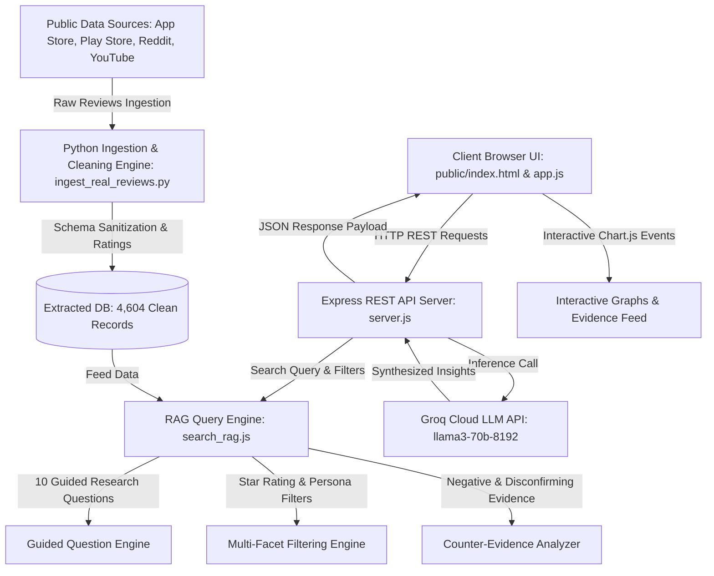

# System Architecture Specification — Myntra AI Discovery Engine

The **Myntra AI Discovery Engine** is an AI-powered consumer behavior research platform engineered for Myntra product managers and growth engineers. It analyzes **4,604 real customer reviews** (App Store, Play Store, Reddit, YouTube) to discover why shoppers save items to their wishlist but abandon them without purchasing within 30 days.

---

## 1. High-Level Architecture Diagram

---

## 2. Structured 20-Attribute Extraction Schema + Rating Field

All extracted user evidence records strictly follow the 20-attribute schema with `null` fallbacks for zero hallucination:

1. `source`: App Store / Play Store / Reddit / YouTube
2. `source_url`: Direct URL or review identifier link
3. `date`: ISO Date String
4. `text`: Verbatim user statement excerpt
5. `relevance_score`: Relevance float (0.0 to 1.0)
6. `user_intent`: Reason product was wishlisted
7. `wishlist_behavior`: How wishlist was used
8. `purchase_status`: Abandoned, Postponed, Bought elsewhere, Purchased
9. `purchase_barrier`: Sizing doubt, fabric trust, price, etc.
10. `uncertainty`: Specific user hesitation
11. `information_needed`: Array of info needed (e.g. Try-on photos)
12. `alternative_considered`: Competitor considered (Ajio, Zara, Meesho)
13. `external_research`: Array of off-app platforms researched (Instagram, YouTube)
14. `workaround`: Action taken off-platform
15. `user_segment`: 1 of 8 Shopper Personas
16. `fashion_category`: Westernwear, Ethnic Wear, Footwear, Lingerie, Beauty, General Apparel
17. `journey_stage`: Accurate Shopper Journey Stage
18. `sentiment`: Positive, Neutral, Negative
19. `evidence_strength`: High (First-person quote), Medium, Low
20. `rating`: Star rating integer (1 to 5)

---

## 3. 8 Shopper Demographic Personas

1. `Gen Z / Myntra FWD Trendseeker`: Shoppers seeking viral, fast-fashion styles and try-on reels.
2. `Working Professional / Premium Wear`: Formal/workwear buyers focused on fabric quality & fitting.
3. `EORS / Value Discount Hunter`: Sale shoppers postponing orders for price drops & bank offers.
4. `Occasional / Festival & Wedding Shopper`: High-intent buyers shopping for specific events.
5. `Plus-Size / Inclusive Fit Shopper`: Shoppers requiring precise measurements and silhouette confidence.
6. `First-Time / Tier-2/3 City Shopper`: New shoppers evaluating Cash-on-Delivery and return policies.
7. `Brand Loyalist / Repeat Buyer`: Frequent buyers expecting consistent sizing across favorite brands.
8. `Mom & Kids / Family Apparel Buyer`: Multi-item buyers shopping for family members.

---

## 4. 10 Core Guided Product Growth Questions

1. Why do users add fashion products to their wishlist?
2. What prevents wishlisted products from eventually being purchased?
3. What uncertainties remain after users have identified a product they like?
4. What causes users to postpone a purchase?
5. How do users compare multiple shortlisted products?
6. What information do users seek outside Myntra/AJIO before purchasing?
7. What role do fit, size, styling, price, reviews, occasion and social validation play?
8. When do users use the wishlist as genuine purchase intent versus simply as a bookmarking mechanism?
9. How do these behaviors differ across user segments?
10. What unmet needs emerge consistently across user conversations?

---

## 5. Interactive Graph Analytics Layer (Click-to-Filter)

- **Theme Volume Bar Chart:** Clicking any bar filters the Evidence Feed directly to that research theme.
- **Rating Breakdown Bar Chart (1-5★):** Clicking any star bar filters the Evidence Feed directly to that star rating.
- **Shopper Segment Share Doughnut Chart:** Clicking any segment slice filters the Evidence Feed directly to that persona.
